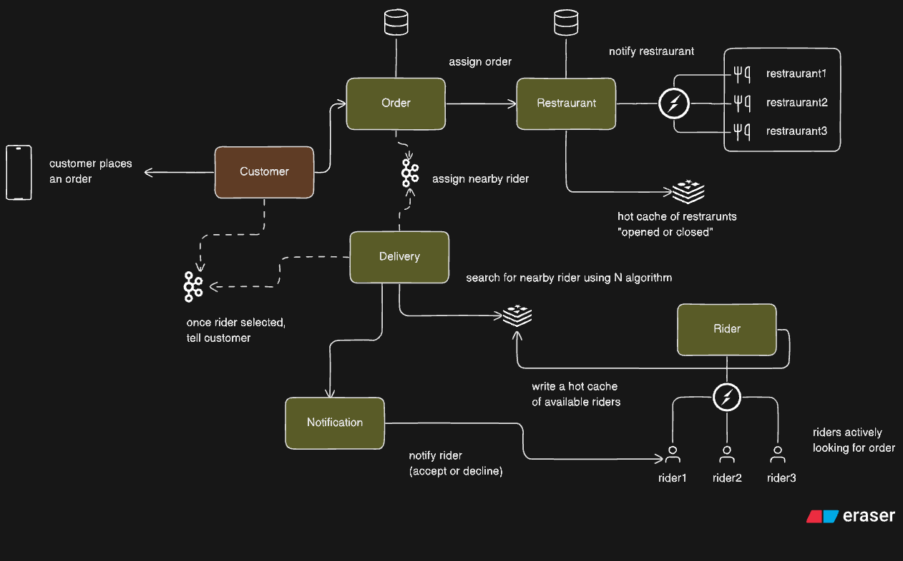

Structured Concurrency & Virtual Threads
=================================================

**Problem:** Concurrency is hard—threads are expensive, tasks leak, errors get lost.**Solution:** Use **virtual threads** (cheap, one-per-task) with **structured concurrency** (tasks live and die within a scope) to make code simple, safe, and scalable.

Key Ideas
---------

*   **Virtual Threads:** JVM-managed, lightweight; write blocking code without exhausting OS threads. Great for I/O-bound work.

*   **Structured Concurrency:** Start tasks in a _scope_; join/cancel together; propagate errors and timeouts predictably.

